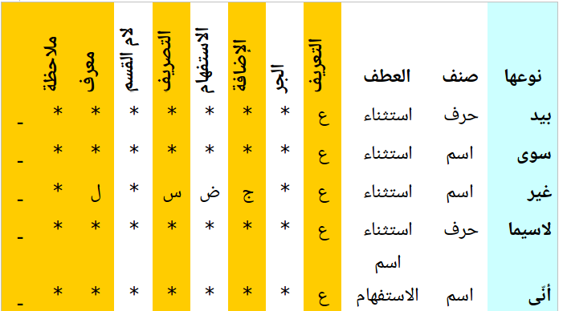

# Arabic Stop words

## Description

It's not easy to detemine the stop words, and in other hand, stop words differs according to the case,
for this purpos, we propose a  classified list which can be parametered by  developper.

The Word list contains only wonds in its commun forms, and we have generated all forms by a script.

It can used as library 'see section arabicstopwords library'

## Files

* data/ : contains  data of stopwords
* data/classified/stopwords.ods: data in LibreOffice format with more valuble informations, and classified stopwords
* docs: docs files
* scripts: scripts used to generate all forms, and file formats

## Data Structure
--------------
All forms data .ODS/CSV file 
- 1st field : unvocalised word ( في)
- 2nd field : unvocalised stemmed word with -'-' between affixes: e.g. ف-ب-خمسين-ي


    
Minimal classified  data .ODS/CSV file 
- 1st field : unvocalised word ( في)
- 2nd field : type of the word: e.g. حرف
- 3rd field : class of word : e.g. preposition

Affixation infomration in other fields:
-    4th field : AIN in arabic , if word accept Conjuction 'العطف', '*' else
-    5th field : TEH in arabic , if word accept definate article 'ال التعريف', '*' else
-    6th field : JEEM in arabic , if word accept preposition  article 'حروف الجر المتصلة', '*' else      
-    7th field : DAD in arabic , if word accept IDAFA  articles 'الضمائر المتصلة', '*' else              
-    7th field : SAD in arabic , if word accept verb conjugation  articles 'التصريف', '*' else       
-    8th field : LAM in arabic , if word accept LAM QASAM   articles 'لام القسم', '*' else       
-    8th field : MEEM in arabic , if word has ALEF LAM as definition article 'معرف', '*' else        

## How to customize stop word list

* check the minimal form data file (stopwords.csv)
* comment by "#" all words which you don't need
* run 
```
make
```
* catch the output of script in releases folder.


## How to update data

* check if the word doesn't exist in the minimal form data file ( classified/stopwords.ods)
* add affixation information
* run 
```
make
```
* catch the output of script in releases folder.

## Arabic Stopwords Library
### install
``` shell
pip install arabicstopwords
```
### usage
* test if a word is stop
``` python
>>> import arabicstopwords.arabicstopwords as stp
>>> # test if a word is a stop
... stp.is_stop(u'ممكن')
False
>>> stp.is_stop(u'منكم')
True
```
* stem a stopword
```python
>>> word = u"لعلهم"
>>> stp.stop_stem(word)
u'لعل'

```
* list all stop words
```
>>> stp.stopwords_list()
......
>>> len(stp.stopwords_list())
13629
>>> len(stp.classed_stopwords_list())
 507
```
* give all forms of a stopword
```python
>>> stp.stopword_forms(u"على")
....
>>> len(stp.stopword_forms(u"على"))
144
```

 
